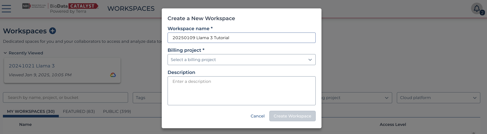
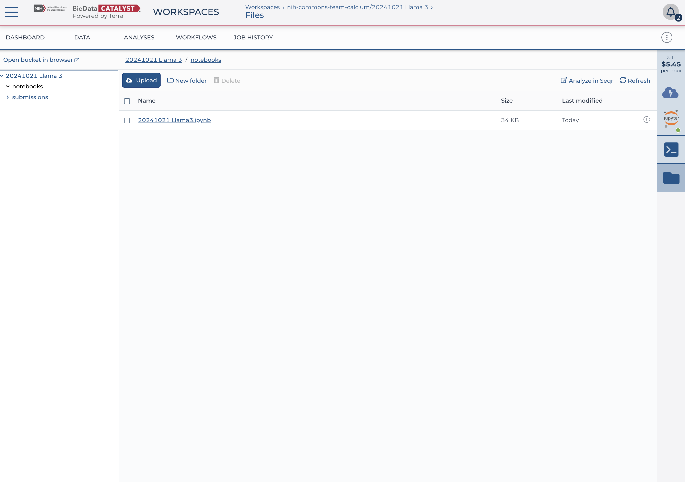

# Tutorial 1 - Hello Llama

## LLMs and You

As an NHLBI researcher, you can leverage an LLM model like Llama3 in BDC to accelerate data analysis, hypothesis generation, and literature review. By training or fine-tuning the model on specialized datasets, such as genomic, proteomic, or clinical trial data, researchers like you can query and synthesize complex relationships between genes, pathways, and diseases like heart failure, pulmonary hypertension, or sickle cell anemia. The model can also assist in natural language tasks like summarizing large volumes of scientific literature, generating insights from unstructured clinical data, or creating tailored communications materials. Additionally, an LLM running in the secure BDC environment ensures data privacy and compliance with regulations when working with sensitive or proprietary datasets, making it a valuable tool in advancing personalized medicine and translational research in cardiovascular, pulmonary, and hematological domains.

## About this Tutorial

This tutorial walks you through doing a very basic interaction with 
the Llama3 LLM on the BDC environment.  We show you how to do this interactively via a notebook on the Terra environment
and in a workflow on Terra and also Velsera.  The notebook approach is great for walking through the code and how
the whole process works while the workflows show how you might scale up and parallelize running models like Llama3.
While the actual demonstration we do is trivial (asking Llama3 to come up with a recipe given ingredients), you 
can use this as a jumping off point for interacting with a highly capable LLM within our secure environment.  In the 
second [tutorial](../tutorial_2_rag_llama/README.md) we will show how to use RAG to better inform the LLM of relevant information that improves the  
quality of the response.

## Running Interactively in a Notebook

Jupyter notebooks provide an interactive coding environment that combines code, visualizations, and explanatory text in a single, easy-to-use interface. They are particularly well-suited for tutorials, as they allow users to write, execute, and modify code in real time, fostering hands-on learning. In this document, we will run through our LLM tutorial on the Terra Jupyter notebook environment, which is optimized for computational research and collaboration. While this tutorial currently runs on Terra, in the near future, it will also be available on Velsera's platform. The Velsera team is actively working to update their notebook instances to support the latest AI libraries required for this tutorial, with updates expected in Q1 2025.

## Getting Access to Llama3

To get started with Llama3, you will first need to create an account on [HuggingFace](https://huggingface.co), a platform for accessing and managing machine learning models. You just need an email address, the account is free. Once your account is set up, generate a personal access token, which will serve as your authentication key for using Hugging Face's resources. In Figure 1 below you can see what my settings look like, look for "Access Tokens" on the left, click on the link, and create a new access token with at least READ permissions.  You will be asked to download the token, do so and keep this very safe!  It allows for programmatic access to HuggingFace so do not share it.  I use 1Password to store it securely, you should use a similar secrets manager to keep it safe. 

**Figure 1** Access Token section of the settings

Finally, apply for access to the Llama3 model through Hugging Face’s platform, as some models require additional permissions due to licensing or usage restrictions.  We're using the `meta-llama/Llama-3.1-8B` model distributed via HuggingFace.  Go to its 
[repository](https://huggingface.co/meta-llama/Llama-3.1-8B) and click the button to apply for access to the model (Figure 2).   These steps ensure access to the Llama3 model for the next steps of the tutorial.  ***It can take 1-2 days to get access so plan accordingly.***

**Figure 2** Login/signup and apply for access to this model, it can take 1-2 days to get access so plan accordingly

## Starting a Notebook Environment in Terra

Now that you have access to the Llama3 model, you’ll need to run our tutorial notebook in the BDC environment using the Terra workspace. At this point, we assume you’ve already gone through the extensive online documentation for BioData Catalyst (BDC) to establish a Terra account, set up billing information, and apply for cloud credits. If you haven’t completed these steps, please review the BDC documentation [here](https://bdcatalyst.gitbook.io/biodata-catalyst-documentation). To continue with this tutorial, you’ll need the ability to create a new Terra workspace and launch a Jupyter notebook environment. Start by logging in to BDC powered by Terra at this [link](https://terra.biodatacatalyst.nhlbi.nih.gov) and creating a new workspace using the plus button. Ensure you have a valid billing project; if you’ve received cloud credits, use the billing project associated with those credits. 

**Figure 3** Create a new Terra workspace to work in

Once you’ve created a workspace (as shown in the Figure 4), navigate to the "Analysis" tab, click the cloud with the lightning bolt icon, and then select the settings icon for Jupyter. 

**Figure 4** Click the cloud icon under the Analysis tab

You’ll see the configuration screen (illustrated in the figure below); make sure to use the same settings specified here to proceed smoothly with the tutorial.

**Figure 5** Settings for the Jupyter environment

## Uploading and Editing the Notebook

Download the notebook ['20241021 Llama3.ipynb'](https://github.com/nhlbidatastage/bdc-ai-tiger-team/blob/main/objective_1.1/notebooks/20241021%20Llama3.ipynb) from this repository, and upload it into your Terra Workspace using the Browse Workspace Files section of the Analsysis tab.  Once uyou upload the file, click on Analsyis again and open the notebook (Edit...) in the newly create Analysis Environment.

**Figure 6** Upload the notebook

At this point you should now see the Llama3 "Hello World" notebook as in Figure 7.

**Figure 7** The open notebook ready for execution

## Running the Notebook

At this point you're good to go, you have 1) a GPU-based environment ready to run the notebook, 2) access to the 
Llama3 model, and 3) a token for working with HuggingFace.

The next step is to run each field in the notebook, one right after the other.  The notebook is self-describing, it mixes 
documentation with working code.  The next step is to execute each of the cells of the notebook.Select each cell of the notebook and use `shift`+`enter` to execute that field.  Make sure you wait for each cell to finish before moving onto the next one, look for the `In [*]` to turn to `In [1]` where `1` is just the count of when that cell was executed.

Some cells are going to take a while to run, for example the `pip` install and the calls to retrieve and run the LLM model.

## A Successful Outcome

Once you're successfully executed each cell of the notebook you'll ultimately be presented with a result to the prompt "I have tomatoes, basil and cheese at home. What can I cook for dinner?".  Now the actual result is variable... sometimes Llama3 produces a 
recipe for pizza, other times a salad or soup.  For example, a fairly common output looks like the following:

> Tomatoes, basil, and cheese are the three main ingredients of one of the most popular Italian dishes: the Caprese salad! The Caprese salad is a typical dish of the Campania region, in particular of the island of Capri. It consists of a simple mix of cherry tomatoes, mozzarella cheese, and basil, seasoned with a drizzle of extra virgin olive oil and a pinch of salt. The Caprese salad is usually served as an appetizer or as a side dish to meat dishes, but it can also be served as a main course.

Nice!  You got an output from the Llama3 LLM

## Next Steps

While it's lovely to get a nice recipe out of Llama3, this probably doesn't help your research.  You're likely to be much more interested in using Llama3 to summarize results, produce publication summaries, help you code a script, or even hypothesis generation.
The model is a general LLM, meaning it's been trained on a ton of data across the web.  While you can use the Llama3 model directly, and
confidently given that it's running in a secure environment, most researchers will want to provide it additional context from your 
research data/resources in order to get the best results out of it.  In the [next tutorial](../tutorial_2_rag_llama/README.md) we
use the Retrieval Augmented Generation (RAG) approach to provide the LLM with context.  In your case this may be research data/metadata, text from publications, or some other domain-specific information that will help improve the accuracy and relevance of your results.